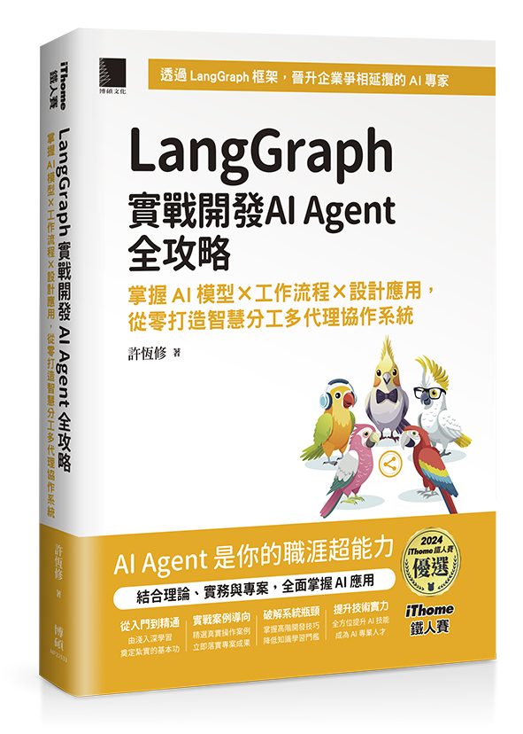

# LangGraph 實戰開發 AI Agent 全攻略：掌握 AI 模型 × 工作流程 × 設計應用
<a href="https://www.tenlong.com.tw/products/9786264142915"></a>

此儲存庫為 iThome 鐵人賽系列書《LangGraph 實戰開發 AI Agent 全攻略：掌握 AI 模型 × 工作流程 × 設計應用，從零打造智慧分工多代理協作系統》的搭配程式範例。上方圖片 `MP22533.jpg` 為書籍封面，已放在專案根目錄，可直接在 README 中顯示。

## 購書管道（點擊前往）

- [天瓏書局（實體書現貨購買）](https://www.tenlong.com.tw/products/9786264142915)
- [博客來（實體書現貨購買）](https://www.books.com.tw/products/0011030699)
- [讀冊生活（TAAZE）（實體書現貨購買）](https://www.taaze.tw/usedList.html?oid=11101071931)
- [MoMo（實體書現貨購買）](https://www.momoshop.com.tw/goods/GoodsDetail.jsp?i_code=14365456&srsltid=AfmBOorLDGHbHEs63zwlidtgIa-A06u1rbCcru5wPL6XRA469jqeqJ_e)
- [Kobo 樂天（電子書醞釀中）](https://www.kobo.com/tw/zh/search?query=LangGraph%20%E5%AF%A6%E6%88%B0%E9%96%8B%E7%99%BC%20AI%20Agent%20%E5%85%A8%E6%94%BB%E7%95%A5)
- [Readmoo（讀墨，電子書醞釀中）](https://readmoo.com/search/keyword?q=langgraph&kw=langgraph&page=1&st=true)
- [Pubu（電子書醞釀中）](https://www.google.com/search?q=site%3Apubu.com.tw+LangGraph+%E5%AF%A6%E6%88%B0%E9%96%8B%E7%99%BC+AI+Agent+%E5%85%A8%E6%94%BB%E7%95%A5)
- [Google Play 圖書（，電子書醞釀中）](https://play.google.com/store/search?q=LangGraph%20%E5%AF%A6%E6%88%B0%E9%96%8B%E7%99%BC%20AI%20Agent%20%E5%85%A8%E6%94%BB%E7%95%A5&c=books)
- [HyRead（凌網，，電子書醞釀中）](https://www.google.com/search?q=site%3Ahyread.com.tw+LangGraph+%E5%AF%A6%E6%88%B0%E9%96%8B%E7%99%BC+AI+Agent+%E5%85%A8%E6%94%BB%E7%95%A5)
- [UDN 讀書吧（，電子書醞釀中）](https://www.google.com/search?q=site%3Areading.udn.com+LangGraph+%E5%AF%A6%E6%88%B0%E9%96%8B%E7%99%BC+AI+Agent+%E5%85%A8%E6%94%BB%E7%95%A5)

## 專案目錄
---------------------

- `notebooks/` — Jupyter notebooks（主要範例與教學）

## 使用指南

1. 克隆此 repository:
   ```
   git clone https://github.com/Heng-xiu/LangGraph-Practical-Guide-to-Developing-AI-Agents.git
   ```

2. 瀏覽 `notebooks/` 目錄以查看每日的教學內容和程式碼範例。

## Star 趨勢

[](https://star-history.com/#Heng-xiu/LangGraph-Practical-Guide-to-Developing-AI-Agents&Date)

## 提問、回饋與貢獻此資料庫

我非常歡迎各種形式的回饋，最適合透過 [GitHub Discussions](https://github.com/Heng-xiu/LangGraph-Practical-Guide-to-Developing-AI-Agents/discussions) 分享。 同樣地，如果您有任何問題，或只是想與其他人交流想法，也請不要猶豫在論壇中提出。

請注意，由於此資料庫包含與實體書對應的程式碼，目前無法接受會擴充主要章節程式碼內容的貢獻，因為這會導致與實體書出現差異。保持一致性有助於確保所有讀者都能獲得流暢的使用體驗。

 
## 引用

如果您覺得本書或程式碼對您的研究有所幫助，請考慮引用它。

Chicago 格式引用：

> Sheu, Heng-Shiou. *LangGraph 實戰開發 AI Agent 全攻略：掌握 AI 模型 × 工作流程 × 設計應用，從零打造智慧分工多代理協作系統*. 博碩文化, 2025. ISBN: 978-626-414-291-5.

BibTeX 格式引用：

```
@book{LangGraph-Practical-Guide-to-Developing-AI-Agent,
  author       = {Heng-Shiou Sheu},
  title        = {LangGraph 實戰開發 AI Agent 全攻略：掌握 AI 模型 × 工作流程 × 設計應用，從零打造智慧分工多代理協作系統},
  publisher    = {drmaster},
  year         = {2025},
  isbn         = {978-626-414-291-5},
  url          = {https://www.drmaster.com.tw/Bookinfo.asp?BookID=MP22533},
  github       = {https://github.com/Heng-xiu/LangGraph-Practical-Guide-to-Developing-AI-Agents}
}
```